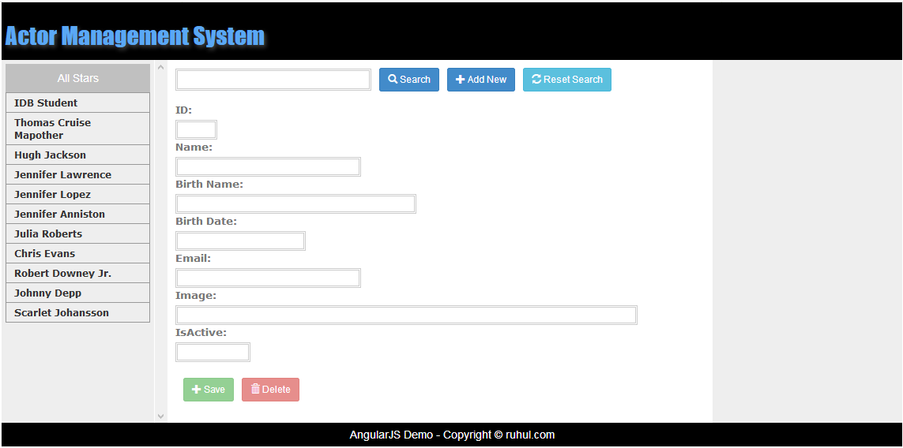
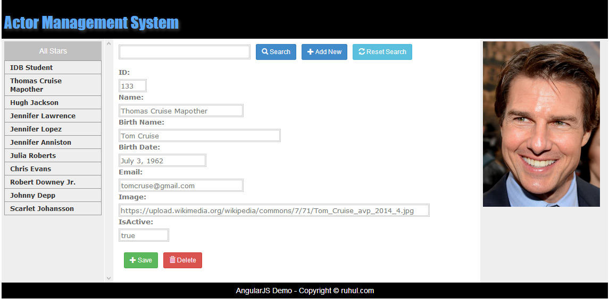
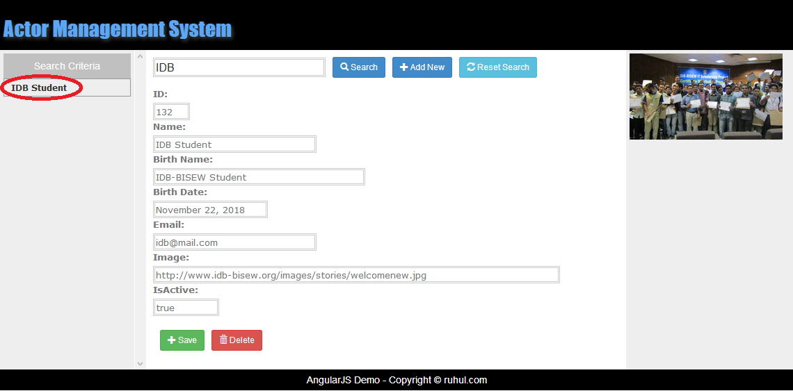
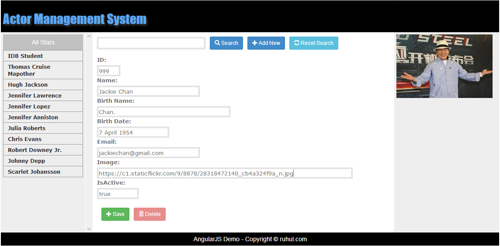
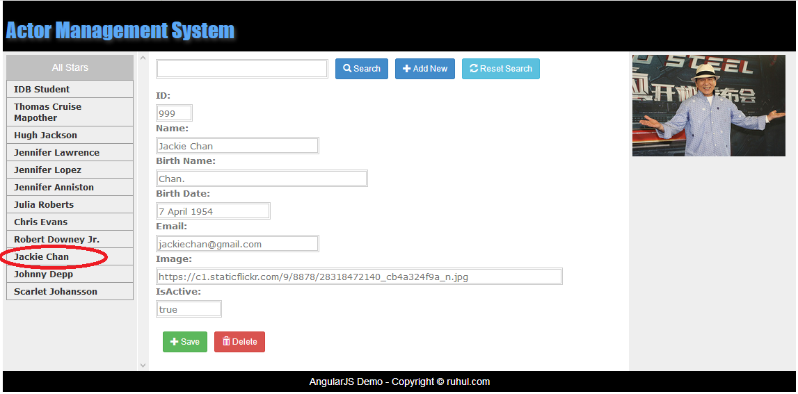

<h1>Name : Actor-Management-System</ha>

<h3>Project Features</h3>
<ol>
  <li>Add actor</li>
  <li>Edit actor information</li>
  <li>Search actors</li>
  <li>Delete actors</li>
  <li>Add image from any link</li>
</ol>

<h3>Development Tools &Technologies</h3>
<ul>
  <li>JAX-RS(Java API for Restful Web Services)</li>
  <li>Jersey Restful Web Services</li>
  <li>Bootstrap</li>
  <li>Angular js</li>
</ul>

<h3>Using IDE for project development</h3>
<ul>
  <li>Spring Tool Suite</li>
</ul>

<h2>index page</h2>

<h2>Actor Details</h2>

<h2>Search Actor</h2>

<h2>Add Actor</h2>

<h2>Add Actor Details</h2>

